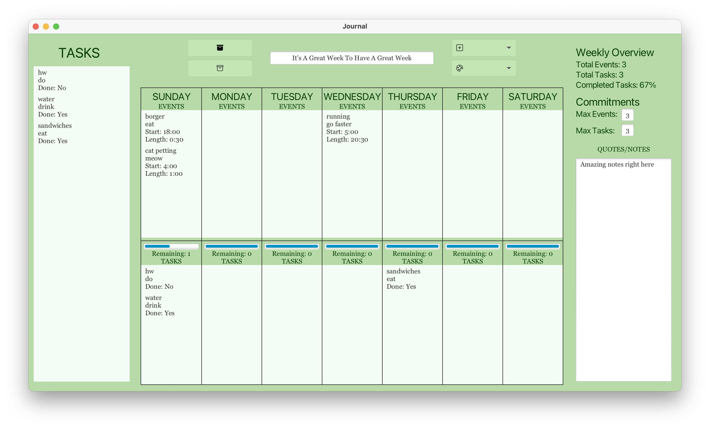

# Welcome to the Object-Oriented Journal™ by Bujava!

Our bullet journal features columns for every day of the week, and separates tasks from events for readability 
and to help priorities remain clear. As an organizational tool, a task queue is built into the left hand side and
statistics are tracked across the week on the right hand side, as well as each individual day's in a progress bar 
to the top of each day's tasks.

Flexibility is key to our journal. Need to redefine a task or change the details to an event? No problem. Simply
click on any of the items you've put in a day to open a popup where you can adjust any aspect you'd like. To help 
with keeping all the little details in place, our application features data validation for every input. There's 
no worries about setting the time to something that's not even a time– we'll catch that and provide a nifty little 
popup.

For those of you who prefer to use a bullet journal to keep references and bookmarks that you'd like to revisit at a 
later date, we're here to help! As a digital bullet journal, we provide functionality in parallel with the web. Just
add or edit an event or task to include a link (http or https, please!) and the next time you select the event the links
will be there ready to go. It's quick and easy, and soon enough maybe you'll find all your tasks have become visiting
webpages– incidentally, kind of our jobs.

Personalization is also so important. That's why we've included three custom-built themes in addition to the default;
a light mode themed sepia to resemble the pages of a book, a dark mode for those who are more comfortable with a 
dimmer screen, and a green theme for those who would like to get outside but currently aren't able to. While it's 
not a replacement for touching grass, we hope that it does prove to come close.

This bullet journal will alleviate your suffering! :)

# SOLID
In an example of the single responsibility principle, our model contains different and separate classes for each
particular part of the bullet journal that does one thing, such as task and event being separate, even as they are
both items. The classes that represent objects in a bullet journal such as Week would only change if the JournalModel
(a container class) had reason to change.

The open-closed principle is demonstrated in the Item interface and how it relates to the AbstractItem class and the 
Event and Task classes. Each event and task implements the methods in the item interface, and each new type of item that
can be added to the bullet journal would as well. The combination of interface and abstract class allow for the current
extending classes to be closed to modification, but the program is open to extension on the whole.

These classes also form an example of the Liskov substitution principle, where any Event or Task can be substituted for
an Item and the program will still behave properly. The Item interface promises a certain kind of behavior, and the way
the extending classes are set up, that principle holds. The controllers and views also function similarly.

The interface segregation principle is shown in how the Controller, View, and Item interfaces have strictly the methods
necessary for their eventual extending classes, such as AbstractController, AbstractView, and AbstractItem. The 
principle states that no code should be forced to depend on methods it does not use. There are no methods that do not 
also make sense as part of the single responsibility principle of OOD. 

The dependency inversion principle is demonstrated throughout our entire application. Instead of relying on concrete
implementations and needing to worry about small details, we have plenty of interfaces and abstract classes that 
guide behavior and atrributes to help maintain the open closed principle as well.

# Future Add-Ons
An additional feature that we could extend our bullet journal with would be custom themes. To do so, we would create
a new .fxml layout of java objects with scenebuilder, and use it in combination with an extended class of 
AbstractSecondaryController. The inputs of the choices themselves would be modeled off of the add event and add
task dialogs currently existing in the program. In specific, to choose the background color, the user may be asked
to enter a hexcode value which would then be validated and processed.

# Deployable Application
Double click to run independently! Right click and select "run" to run in IntelliJ.

WARNING: may not work on windows machines.

JAR file [here!](src/pa05-template-1.0-SNAPSHOT-all.jar)

# Credits
We did not use any attributed images in this program. 
There is a picture in the resources folder with bunnies that I took one day behind Richards and tiled.
